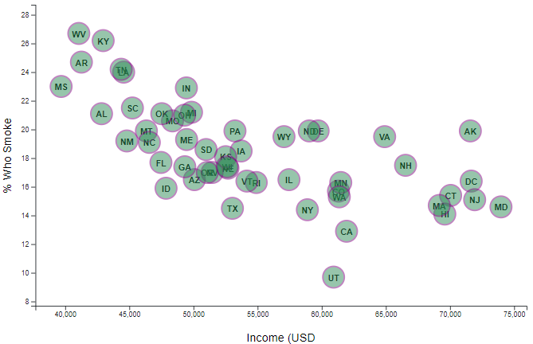

# Data Journalism - Smoking and Income Trends  

## Table of contents
* [Assignment](#assignment)
* [Data Sources](#data_sources)
* [Data Visualization](#vis)
* [Evaluation](#eval)
* [References](#ref)

## Assignment
Use JavaScript with html, D3, scalable vector graphics (svg) to generate an interactive chart of health risks based on data from the US Census Bureau. 

## Data Sources
Style sheets were provided, as was a csv containing US Census Bureau data.  Original files can be found at the links below: 

* U.S. Census Bureau and the Behavioral Risk Factor Surveillance System data: https://github.com/KLacerda08/D3-Challenge/tree/main/D3_data_journalism/assets/data
* d3Style sheet: https://github.com/KLacerda08/D3-Challenge/blob/main/Resources/StarterCode/assets/css/d3Style.css
* html style sheet: https://github.com/KLacerda08/D3-Challenge/blob/main/Resources/StarterCode/assets/css/style.css 
* bootsrap style sheet: https://stackpath.bootstrapcdn.com/bootstrap/4.1.3/css/bootstrap.min.css" integrity="sha384-MCw98/SFnGE8fJT3GXwEOngsV7Zt27NXFoaoApmYm81iuXoPkFOJwJ8ERdknLPMO

## Data Visualization
The index.html file contained the framework to store the data visualization, which was created using D3 and svg. The data series I selected for plotting included
the percentace of the population who smokes (fieldname "smokes"), and the population income (fieldname "income").  The data visualization was coded in the app.js 
file and included the following general steps:
* Creation of the svg wrapper
* Importing and parsing the data
* Creating scale and axis functions based on the data ranges, and appending these to the svg chartgroup
* Creating and appending the scatter plot markers (circles)
* Creating and appending axes ticks to the svg chargroup
* Creating and appending axis labels.  
* Creating and appending tooltips with additional information as an interactive feature for the datapoint markers.  

Run the following code in live server to visualize the chart: 
https://github.com/KLacerda08/D3-Challenge/blob/main/D3_data_journalism/index.html

## Evaluation - Smoking vs. Income 

Data from the US Census Bureau provides for a multi-faceted evaluation of health risks and socioeconomic factors.  Based on the data, there is a correlation between smoking and income level:  the percentage of people who smoke decreases with increased income. The US Dept. of Labor reports that those educated with a "professional"  degree make more money (https://www.dol.gov/general/topic/wages/educational). Therefore, at first look, the correlation between smoking and income would seem to suggest that the "blue collar" population smokes more than the those who receive a more "formal" education. However, the data is presented per state, and it is not clear whether income has been normalized to account for cost of living index. For instance, compare the data for New Jersey to that of West Virginia: in NJ, approximately 15% of the population smokes, and the (presumably median) income is about $72,000. In WV, about 27% of the population smokes, and the median income is about $42,000. However, a person making $42K in WV may hold the same job as a person making $72K in NJ. To better understand what socioeconomic population is most affected by smoking, it may be helpful to add an evaluation of income normalized by a cost-of-living index factor.

## References
Readme image source: 
https://www.unh.edu/healthyunh/blog/tobacco/2017/11/tobacco-and-your-wallet
https://depositphotos.com/140091338/stock-photo-data-science-newspaper-article-text.html